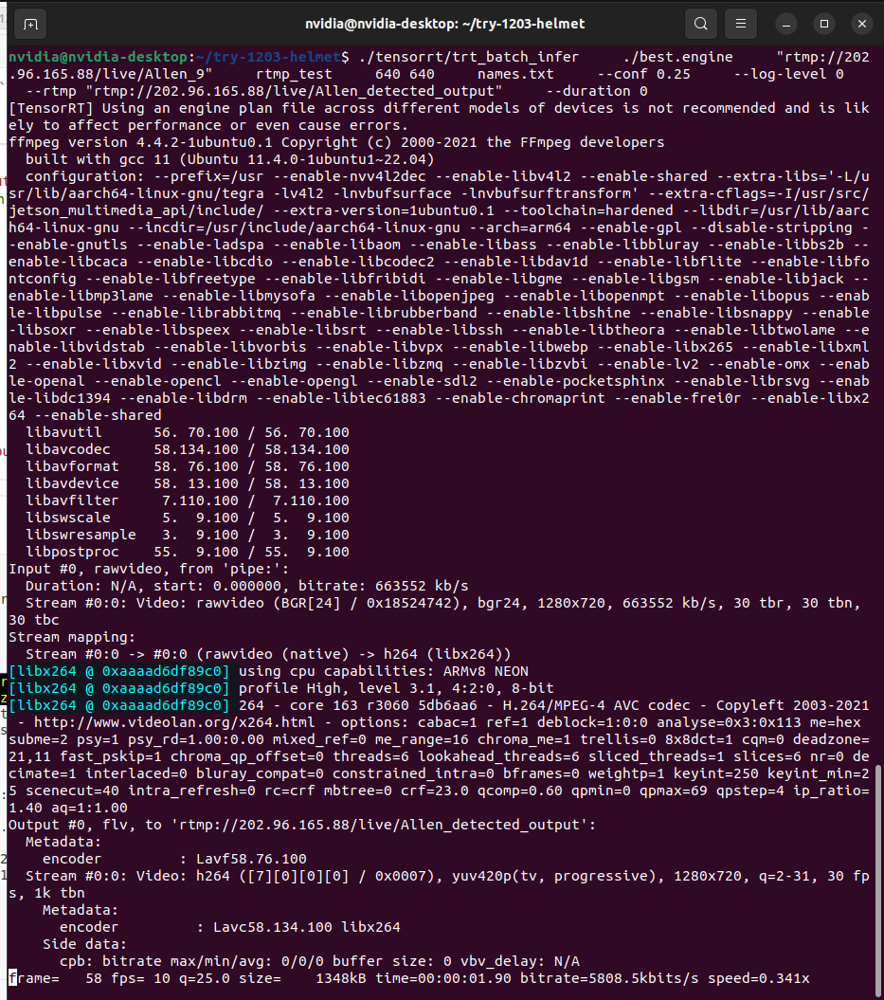

# Jetson Orin Nano 安全帽检测设备 - 命令行操作手册
**很重要的提醒：name.txt 的最后一行，请保持多一个空格的状态，便于维护。** 
## 文件目录结构
请打开home文件夹,进入try-1203-helmet,您将看到：
```
├── best.engine                    # TensorRT模型文件
├── tensorrt/
│   └── trt_batch_infer           # 主检测程序
├── input_photos/                  # 批量输入图片样例
│   ├── hh1.png
│   ├── hh2.png
│   └── hh3.png
├── test_photo.png                 # 单张测试图片
├── test_video.mp4                 # 测试视频
├── test_no_helmet.mp4             # 测试无安全帽报警视频
├── README.md                      # 说明文档
└── names.txt                      # 检测类别标签
```

## 快速测试
设备开机后，在终端执行以下命令，进入检测文件夹：
```bash
cd ~/try-1203-helmet #检测文件目录
```
- 查看结果： 打开文件夹，进入打开home文件夹,进入try-1203-helmet

## 图片检测-支持：.png .jpg .jpeg .bmp
### 1. 检测单张图片
```bash
cd ~/try-1203-helmet
./tensorrt/trt_batch_infer best.engine test_photo.png output 640 640 names.txt --log-level 1
#./「执行文件」 「model」 [input_img] [output_folder] [width] [height] [name.txt] 
```
这时回到文件夹界面，可在output文件夹下找到每帧图像，并在alarm文件夹下找到报警帧

### 2. 检测批量图片
```bash
cd ~/try-1203-helmet
./tensorrt/trt_batch_infer best.engine input_photos/ output 640 640 names.txt --log-level 1
#./「执行文件」 「model」 [input_img_folder] [output_folder] [width] [height] [name.txt] [日志等级为1]
```
这时回到文件夹界面，可在output文件夹下找到每帧图像，并在alarm文件夹下找到报警帧。
## 视频检测-支持：.mp4 .avi .mov .mkv
### 1. 视频文件检测并输出视频

```bash
cd ~/try-1203-helmet
./tensorrt/trt_batch_infer best.engine test_video.mp4 output 640 640 names.txt --out-video result.mp4 --log-level 1
#./「执行文件」 「model」 [input_video] [output_folder] [width] [height] [name.txt] [此处选项为输出一个视频] [日志等级为1]
```
这时回到文件夹界面，可在output文件夹下找到每帧图像，并在alarm文件夹下找到报警帧。请耐心等待检测视频生成
---
## RTMP、RTSP流
**rtmp输出时，若log--level为0，则应为下方图像。**

终端全屏状态下，最下方一行应当为：
> frame = xxx fps = x q=x size = x kb time=xx:xx:xx:xx bitrate= x kbits/s speed=xx
- 终端输入 `Ctrl + C` 可强行结束
### 1. RTSP输入 + RTMP输出 (如没有rtsp设备，可跳过此步骤)
```bash
cd ~/try-1203-helmet
./tensorrt/trt_batch_infer best.engine "rtsp://..." output 640 640 names.txt --rtmp "rtmp://..." --log-level 0
#./「执行文件」 「model」 [input_url] [output_folder] [width] [height] [name.txt] [此处选项为输出rtmp流] [日志等级为1]
# 这里是一个例子，请在测试时将换成自己的rtsp、rtmp流
```
### 2. rtmp输入 + rtmp输出 
```bash
mkdir -p rtmp_test && \
./tensorrt/trt_batch_infer \
    ./best.engine \
    "rtmp://202.96.165.88/live/Allen_9" \
    rtmp_test \
    640 640 \
    names.txt \
    --conf 0.25 \
    --log-level 0 \
    --rtmp "rtmp://202.96.165.88/live/Allen_detected_output" \
    --duration 0
    #duration-> 持续时间， 为 0 则无限
    #流地址请自行替换
    
mkdir -p rtmp_test && \
./tensorrt/trt_batch_infer \
    ./best.engine \
    "192.168.2.200:1935/live/1581F8HGX252500A003W-99-0-0" \
    rtmp_test \
    640 640 \
    names.txt \
    --conf 0.25 \
    --log-level 0 \
    --rtmp "rtmp://202.96.165.88/live/Allen_detected_output" \
    --duration 0
    
    192.168.2.200:1935/live/1581F8HGX252500A003W-99-0-0
    
    
    
```
程序运行后，可登录SRS服务器`http://202.96.165.88:1985/console/ng_index.html#/streams`查看rtmp推流是否成功
下图所示为成功：
- 若需要观看推流画面，可下载任意支持网络流的播放器，并将rtmp://202.96.165.88/live/..(你的推流地址) 复制进播放器中观看

## 常用选项

### 置信度调整
```bash
# 默认0.25，提高可减少误报
./tensorrt/trt_batch_infer ... --conf 0.4
# 降低可减少漏检
./tensorrt/trt_batch_infer ... --conf 0.15
```

### 告警图片保存
_自动保存在输出文件夹下的alarm文件夹下，无需手动设置选项_

### 日志控制
```bash
# 仅错误信息
./tensorrt/trt_batch_infer ... --log-level 0
# 正常信息（推荐）
./tensorrt/trt_batch_infer ... --log-level 1
# 详细调试信息（长视频或rtsp、rtmp实时画面勿开）
./tensorrt/trt_batch_infer ... --log-level 2
```

## 设备维护

### 查看设备状态
```bash
# 查看GPU使用
sudo tegrastats

# 查看存储空间
df -h ~/try-1203-helmet

# 查看程序进程
ps aux | grep trt_batch_infer
```

### 程序管理
```bash
# 停止所有检测程序
pkill trt_batch_infer

# 检查程序是否运行
pgrep trt_batch_infer
```

##  常见问题

### Q1：程序找不到
确保在执行目录：
```bash
cd ~/try-1203-helmet
ls tensorrt/trt_batch_infer
```

### Q2：权限错误
```bash
chmod +x tensorrt/trt_batch_infer
```

### Q3：输出目录已存在
```bash
# 使用新目录名
./tensorrt/trt_batch_infer ... new_output ...

# 或删除旧目录
rm -rf output
```

## 📞 技术支持

### 获取帮助时请提供：
1. 执行的完整命令
2. 终端显示的错误信息
3. 运行以下诊断命令的结果：
```bash
cd ~/try-1203-helmet
./tensorrt/trt_batch_infer best.engine test_photo.png diagnose 640 640 names.txt --log-level 2
```

### 紧急重启
如果设备无响应：
1. Ctrl + Alt + Delete

---

**提示**：首次使用建议先用 `test_photo.png` 测试，确认系统正常工作。
**再次提醒：name.txt 的最后一行，请保持多一个空格的状态，便于维护。** 
